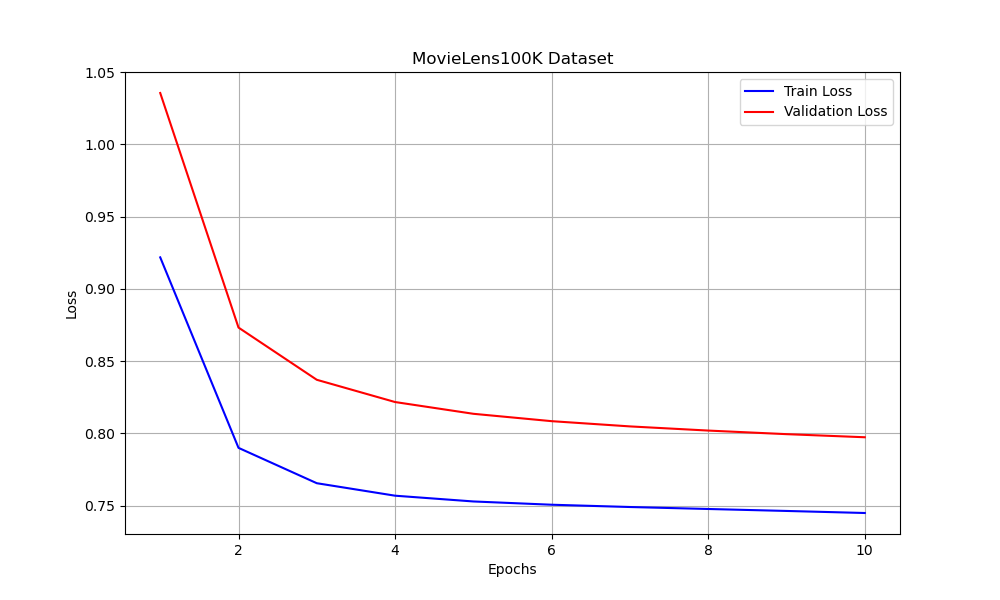
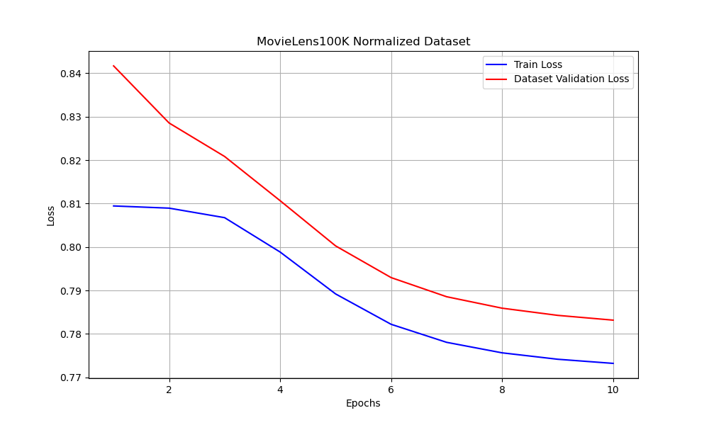
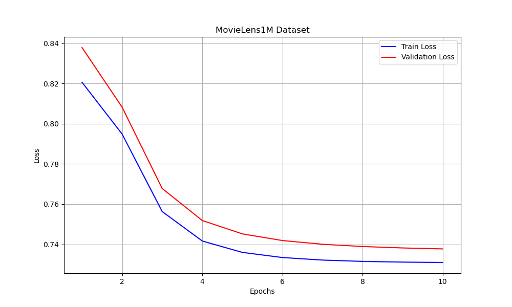
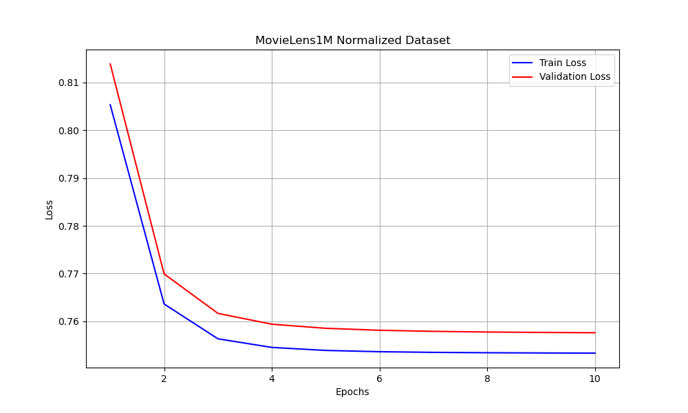

# Movie Recommendation System using Explainable Matrix Factorization

Our project tackles the problem of information overload that internet users face because there's so much data available. This makes it hard for people to find relevant information and affects their experience. We aim to solve this by creating a Movie Recommender System that suggests movies based on user preferences. This system helps users find relevant content more easily and improves how online content is delivered in various digital applications.

## Dataset Used
For the purpose of experimentation we have used two datasets, MovieLens-100k and MovieLens-1M. These datasets are a widely used benchmark in the field of movie recommendation research.

## Methodology
1. User-to-User Similarity : To quantify the similarity between users based on their ratings.
2. Explainable Score Computation : User-to-user similarity was used to assign appropriate weights to each interaction, reflecting its relevance to the user’s preference and interests.
3. Explainable Matrix Factorization (EMF) : The model uses the calculated explainable score to enhance traditional matrix factorization. EMF incorporates an additional regularization term, coupled with explainability weights, to learn latent factors.

## Results

#### Training and Validation Loss: MovieLens100k Dataset

#### Training and Validation Loss: MovieLens100k Normalized Dataset

#### Training and Validation Loss: MovieLens1M Dataset

#### Training and Validation Loss: MovieLens1M Normalized Dataset

See [project report](./Report/Recommendation%20System%20for%20Movies%20x%20ML%20Project%20Sem%202%20(2).pdf) for further details.

## Authors
Khushi Jain, Purnima Kumar, Nachiket Nasa, Yashi Sharma
Department of Computer Science
University of Delhi